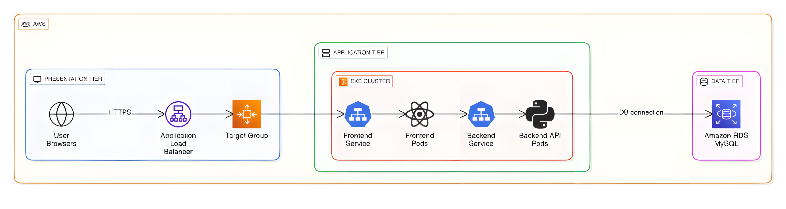
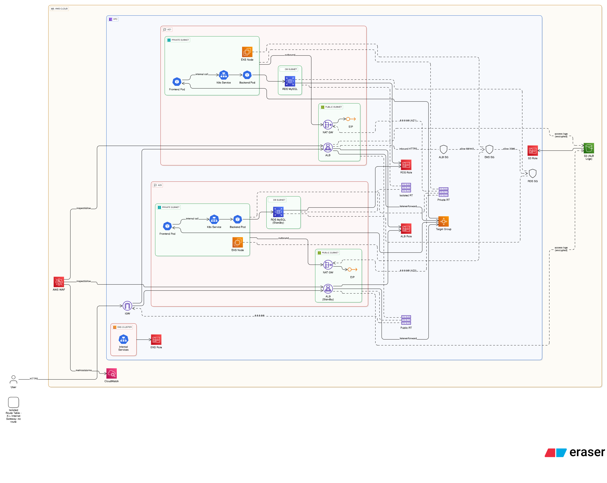

# 3-Tier Architecture on AWS EKS

## Overview
This project sets up a comprehensive 3-tier architecture on AWS EKS, consisting of a frontend, backend, and database layer. The infrastructure is provisioned using Terraform, and the application is deployed using Kubernetes manifests.

## Architecture
The architecture includes:
- **Frontend Tier**: React application served through an Application Load Balancer (ALB)
- **Application Tier**: Python API services running on EKS
- **Database Tier**: MySQL RDS database for data persistence



## High Level Overview
Internet
    ↓
AWS Application Load Balancer (ALB)
    ↓
Kubernetes Service (Type: LoadBalancer)
    ↓
Frontend Pods (React App)
    ↓
Kubernetes Service (ClusterIP)
    ↓
Backend Pods (Python API)
    ↓
Kubernetes Service (ClusterIP)
    ↓
RDS MySQL Database

All components are secured with AWS WAF for rate limiting, security groups, and private subnets for isolation.



## Prerequisites
1. AWS CLI installed and configured with `aws configure`
2. Terraform installed
3. kubectl installed
4. Base64 encoding tool (available on most Unix systems)

## Infrastructure Setup

### 1. Initialize Terraform
Navigate to the infrastructure directory and initialize Terraform:
```
cd infra/environments/dev
terraform init
```

### 2. Configure Variables
Adjust the `dev.tfvars` file according to your requirements.

### 3. Validate Configuration
Check for any syntax errors:
```
terraform validate
```

### 4. Review Execution Plan
See the plan before applying:
```
terraform plan --var-file dev.tfvars
```

### 5. Apply Configuration
If you confirm the plan, apply the configuration:
```
terraform apply --auto-approve --var-file dev.tfvars
```

### 6. Retrieve Outputs
After successful provisioning, retrieve the following outputs:
```
terraform output waf_acl_arn
terraform output alb_security_group_id
terraform output alb_logs_bucket_name
terraform output rds_instance_endpoint
```
Copy these values for later use.

## Kubernetes Configuration

### 1. Update Kubeconfig
The kubeconfig file is stored at `/modules/eks/` folder. Adjust it with your system to operate with kubectl CLI.

### 2. Prepare Values for Manifests
Paste the copied values into:
- `k8s-manifests/ingress.yaml`: For WAF ACL ARN, ALB security group ID, and S3 bucket name
- `k8s-manifests/secrets_configmaps.yaml`: For RDS endpoint in the host section

### 3. Base64 Conversion
Make sure the RDS endpoint value is base64 converted. Use this command:
```
echo -n 'your_database_endpoint' | base64
```

## Application Deployment

Apply the Kubernetes manifests into the cluster:
```
kubectl apply -f k8s-manifests/
```

## Verification
1. Check the ALB DNS name from Terraform outputs
2. Access your application through the ALB endpoint
3. Verify that the WAF rate limiting is working
4. Check the S3 bucket for ALB access logs

## Troubleshooting
- Ensure all AWS credentials are properly configured
- Verify that the base64 encoding of the RDS endpoint is correct
- Check Kubernetes pod status if the application is not accessible
- Review CloudWatch logs for any errors

## Security Features
- AWS WAF for rate limiting at the edge
- Security groups for network isolation
- Private subnets for backend components
- RDS database with security group restrictions
- S3 bucket with encryption and access controls