<div align="center">

# Progressive Delivery Platform

### An Observability-Driven GitOps Release System for Kubernetes

*Deployments that promote or roll themselves back based on real production telemetry — not hope.*

[](https://kubernetes.io)
[](https://argoproj.github.io/cd)
[](https://argoproj.github.io/rollouts)
[](https://prometheus.io)
[](https://github.com/aquasecurity/trivy)
[](./LICENSE)

</div>

---

## What this is

This repository is a **production-grade platform engineering reference implementation**. It models how an internal Platform Engineering / SRE team at a large enterprise builds an **autonomous deployment platform** that decides — using live production signals — whether a release should be promoted or automatically rolled back.

It is intentionally **not** a "CI/CD tutorial". The center of gravity is **reliability**: the platform treats every deployment as a hypothesis to be validated against Service Level Objectives (SLOs) and an error budget, and it acts on the result without a human in the loop.

> **Business context:** the fictional company **Acme Commerce** runs a global Kubernetes e-commerce platform (`frontend`, `payment`, `order`, `inventory`, `notification`) shipping dozens of releases per day. Traditional CI/CD auto-promoted releases without validating production health, causing repeated incidents. This platform is the Platform/SRE team's answer.

## The deployment lifecycle in one picture

```mermaid
flowchart LR
    dev["Developer<br/>git push"] --> ci["GitLab CI"]
    ci --> sec["DevSecOps Gate<br/>Trivy · Syft · Cosign"]
    sec --> reg["Container Registry<br/>signed image + SBOM"]
    reg --> gitops["GitOps Repo<br/>desired state"]
    gitops --> argocd["Argo CD<br/>sync"]
    argocd --> rollouts["Argo Rollouts<br/>canary 5→20→50→100%"]
    rollouts --> analysis["Prometheus Analysis<br/>AnalysisTemplates"]
    analysis --> slo{"SLOs met?"}
    slo -- "yes" --> promote["Automatic<br/>Promotion"]
    slo -- "no" --> rollback["Automatic<br/>Rollback"]
    rollback --> incident["Incident Created<br/>+ Dashboard Annotation"]
    promote --> report["Deployment Report"]
    incident --> report

    classDef good fill:#1f6f43,stroke:#0c3,color:#fff;
    classDef bad fill:#7a1f1f,stroke:#c33,color:#fff;
    class promote good;
    class rollback,incident bad;
```



## Core capabilities

| Capability | How it is delivered |
|---|---|
| **GitOps** | Git is the single source of truth; Argo CD reconciles desired state continuously. |
| **Progressive delivery** | Argo Rollouts canary steps: **5% → 20% → 50% → 100%** with automated analysis between steps. |
| **Observability-driven decisions** | Prometheus `AnalysisTemplates` evaluate SLOs at each step and gate promotion. |
| **Automatic rollback** | Any failing SLO aborts the rollout and restores the last-known-good version. |
| **DevSecOps supply chain** | Trivy scanning, Syft SBOM generation, Cosign image signing — enforced in CI. |
| **Full telemetry** | Prometheus (metrics), Loki (logs), OpenTelemetry (traces), Grafana (dashboards), Alertmanager (routing). |
| **Infrastructure as Code** | Terraform modules for cloud topology; Kind for local development. |
| **Operational excellence** | ADRs, runbooks, troubleshooting guides, fault-injection scenarios, demo scripts, Makefile workflow. |

## Reusable AnalysisTemplates (SLO checks)

The platform ships reusable, parameterized analysis templates used by any service:

- HTTP success rate
- HTTP 5xx error rate
- P95 latency
- Container restart count
- CPU utilization
- Memory utilization
- Payment success rate (business SLO)
- Checkout success rate (business SLO)

## Technology stack

`GitLab CI` · `Go 1.26` · `Kubernetes` · `Gateway API` / `Envoy Gateway` · `Helm` / `Kustomize` · `Argo CD` · `Argo Rollouts` · `Prometheus` · `Grafana` · `Loki` · `OpenTelemetry` · `Alertmanager` · `NATS JetStream` · `Trivy` · `Cosign` · `Syft` · `Terraform` · `Docker` · `k3s`

## Repository layout

> The repository is built **incrementally, one phase at a time**. Directories appear as their phase is implemented. See **[docs/PHASES.md](./docs/PHASES.md)** for the full roadmap and current status.

```text
observability-driven-gitops-release-system/
├── README.md                 # you are here
├── Makefile                  # single entrypoint for every workflow
├── docs/                     # architecture, ADRs, runbooks, SLO design
│   ├── PHASES.md             # delivery roadmap + status
│   ├── architecture/         # system + lifecycle diagrams (Mermaid)
│   └── adr/                  # Architecture Decision Records
├── scripts/                  # reusable shell automation
├── clusters/                 # local k3s platform: bootstrap + config (phase 2)
├── apps/                     # Acme microservices (Go) + Dockerfiles (phase 3)
├── infra/                    # Terraform: reusable AWS modules + per-env state (phase 4)
├── observability/            # Prometheus, Grafana, Loki, Alloy, OTel + SLIs (phase 5)
├── gitops/                   # Argo CD app-of-apps + desired state (phase 6)
├── rollouts/                 # Argo Rollouts + reusable AnalysisTemplates (phase 7)
├── ci/                       # (phase 8) GitLab CI + DevSecOps
└── demos/                    # (phase 10) demo + fault-injection scenarios
```

## Quick start

### Prerequisites

- A **Linux** host (k3s runs as a `systemd` service; on Windows use WSL2, on macOS a Linux VM)
- **sudo** privileges, **Docker** running, and **kubectl** + **curl** on your `PATH`

```bash
# verify your local toolchain (docker, kubectl, k3s deps, ...)
make check-tools

# show every available workflow target with descriptions
make help
```

### Phase 2 — bring up the local platform

A single command provisions a complete local Kubernetes platform: a pinned **k3s** cluster, a **local container registry**, the **ingress-nginx** controller, and the platform **namespaces**.

```bash
make up                                   # create the cluster (idempotent, ~1–3 min)
eval "$(make kubeconfig)"                  # point your shell at the cluster
make cluster-info                          # read-only health summary
```

What you get:

| Component | Detail |
|---|---|
| k3s cluster | Single node `acme-platform`, pinned version, bundled metrics-server + CNI |
| Local registry | `localhost:5000` wired into k3s containerd for an offline build→deploy loop |
| Ingress | **Gateway API v1.5** via **Envoy Gateway** — the canary traffic router used in Phase 7 |
| Namespaces | `acme`, `argocd`, `monitoring`, `argo-rollouts` |

Tear it down when you're done:

```bash
make down                                  # prompts before destroying
```

> Full step-by-step instructions, configuration knobs, the local-registry workflow, and a troubleshooting table live in **[clusters/README.md](./clusters/README.md)**.

## Documentation index

- **[Phased delivery roadmap](./docs/PHASES.md)**
- **[Architecture overview](./docs/architecture/overview.md)**
- **[Architecture Decision Records](./docs/adr/README.md)**
- **[Phase 2 — Local platform operator guide](./clusters/README.md)**
- **[Phase 3 — Acme microservices guide](./apps/README.md)**
- **[Phase 4 — Infrastructure as Code guide](./infra/README.md)**
- **[Phase 5 — Observability stack guide](./observability/README.md)**
- **[Phase 6 — GitOps with Argo CD guide](./gitops/README.md)**
- **[Phase 7 — Progressive delivery guide](./rollouts/README.md)**

## Project status

🟢 **Phase 7 — Progressive Delivery: complete.** Argo Rollouts canaries (5→20→50→100%) gated by 8 reusable Prometheus AnalysisTemplates auto-promote or auto-rollback. See [docs/PHASES.md](./docs/PHASES.md) for what's next.

## License

Licensed under the Apache License 2.0. See [LICENSE](./LICENSE).
