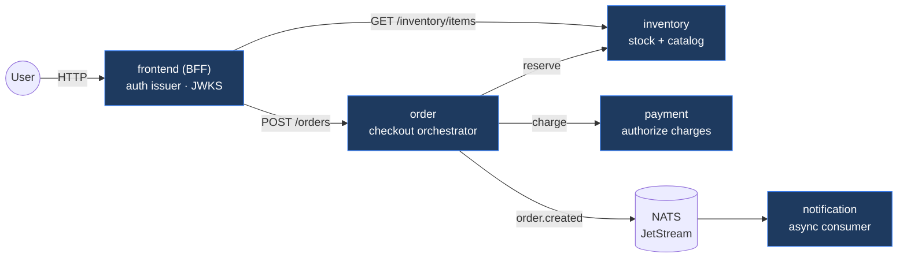

# Phase 3 — Acme Microservices

> Five small, fully instrumented Go services that make up the Acme Commerce storefront. They exist to be **deployed, observed, and progressively rolled out** by the rest of the platform — so each emits the exact RED and business metrics the Phase 7 `AnalysisTemplate`s evaluate.

## Services & responsibilities



| Service | Role | Key endpoints | Business metric (SLO source) |
|---|---|---|---|
| **frontend** | Storefront BFF + auth entry; mints EdDSA JWTs, serves JWKS, proxies to order/inventory | `POST /login`, `GET /api/products`, `POST /api/checkout`, `GET /.well-known/jwks.json` | `frontend_checkouts_total{result}` |
| **order** | Checkout orchestrator: reserve → charge → publish event | `POST /orders` (auth) | `orders_total{result}` → **checkout success** |
| **payment** | Authorizes charges | `POST /payments` (auth) | `payments_total{result}` → **payment success** |
| **inventory** | Catalog + stock reservation | `GET /inventory/items`, `POST /inventory/reserve` (auth) | `inventory_reservations_total{result}` |
| **notification** | Consumes `order.created`, sends notifications | (async consumer) | `notifications_sent_total{channel}` |

Every service also exposes the platform standard endpoints: `GET /healthz` (liveness), `GET /readyz` (readiness), `GET /metrics` (Prometheus), plus the RED metrics `http_requests_total`, `http_request_duration_seconds`, `http_requests_in_flight`.

## Why Go + these libraries (June 2026)

- **Go 1.26** — tiny static binaries, fast builds, first-class Prometheus/OTel SDKs, minimal distroless images.
- **`net/http` (1.22+ routing)** — method+path patterns in the standard library; no web framework dependency.
- **prometheus/client_golang** — RED + business metrics that drive AnalysisTemplates.
- **OpenTelemetry (otelhttp)** — inbound spans + trace-propagating HTTP client → connected distributed traces.
- **NATS JetStream** — lightweight durable event bus (ADR-0007).
- **golang-jwt v5 (EdDSA)** — asymmetric, verify-only auth via JWKS (ADR-0006).

## Repository layout

```text
apps/
├── go.mod / go.sum
├── Dockerfile                 # one parameterized multi-stage build for all services
├── deploy/docker-compose.yaml # local inner loop: NATS + 5 services
├── pkg/                       # shared platform libraries
│   ├── app/        # service bootstrap (logging, tracing, metrics, server, workers)
│   ├── auth/       # EdDSA JWT issue/verify + JWKS + middleware
│   ├── config/     # 12-factor env config
│   ├── events/     # NATS JetStream publish/consume wrapper
│   ├── faults/     # env-driven fault injection (FAIL_RATE / LATENCY_MS)
│   ├── health/     # liveness/readiness checker
│   ├── httpx/      # router, server, middleware, JSON helpers
│   ├── logging/    # structured slog JSON logging
│   └── obs/        # Prometheus metrics + OTel tracing setup
└── services/
    ├── frontend/  payment/  order/  inventory/  notification/
```

## Run locally (no Kubernetes)

The fastest way to run the whole system is docker compose, which also starts NATS:

```bash
make compose-up          # builds images, starts NATS + 5 services
# storefront on http://localhost:8080

# 1) get a token
TOKEN=$(curl -s -XPOST localhost:8080/login -d '{"username":"alice"}' | jq -r .access_token)

# 2) browse the catalog
curl -s localhost:8080/api/products | jq

# 3) place an order (async notification fires via NATS)
curl -s -XPOST localhost:8080/api/checkout \
  -H "Authorization: Bearer $TOKEN" \
  -d '{"items":[{"sku":"SKU-MUG","qty":2}]}' | jq

make compose-down
```

To watch an SLO degrade (the signal Phase 7 uses to roll back), restart payment with a failure rate:

```bash
# in apps/deploy/docker-compose.yaml set payment FAIL_RATE: "0.5", then:
make compose-up
# checkouts now intermittently return 402; payments_total{result="declined"} climbs
```

## Build container images

Images build from the single parameterized `Dockerfile` into the Phase 2 local registry:

```bash
make build-apps              # build all five (tag = git short sha)
PUSH=1 make build-apps        # build and push to localhost:5000
TAG=v1.2.3 PUSH=1 make build-apps
SERVICES="payment order" make build-apps   # subset
```

Each image is distroless, non-root (uid 65532), static (CGO disabled), and labeled with OCI metadata. Phase 8 adds Trivy scanning, Syft SBOMs, and Cosign signing to this build.

## Configuration (environment variables)

| Variable | Default | Applies to | Purpose |
|---|---|---|---|
| `PORT` | `8080` | all | HTTP listen port |
| `LOG_LEVEL` | `info` | all | `debug`/`info`/`warn`/`error` |
| `APP_VERSION` | `dev` | all | reported in logs/labels |
| `OTEL_EXPORTER_OTLP_ENDPOINT` | _(unset)_ | all | OTLP/HTTP traces; unset = tracing no-op |
| `AUTH_SEED` | dev seed | all | 32-byte hex Ed25519 seed (override outside local) |
| `AUTH_ISSUER` / `AUTH_AUDIENCE` | `acme-frontend` / `acme-platform` | all | JWT validation |
| `AUTH_TOKEN_TTL` | `1h` | frontend | token lifetime |
| `NATS_URL` | _(unset)_ | order, notification | broker; unset = events no-op |
| `INVENTORY_URL` / `PAYMENT_URL` | `http://…:8080` | order, frontend | downstream targets |
| `ORDER_URL` | `http://order:8080` | frontend | downstream target |
| `FAIL_RATE` / `LATENCY_MS` | `0` / `0` | payment, order, inventory | fault injection for demos |

## Validate the code

```bash
make test-apps     # go vet ./... && go build ./...
```

## Design decisions

- [ADR-0006](../docs/adr/0006-authentication-eddsa-jwt.md) — EdDSA JWT authentication
- [ADR-0007](../docs/adr/0007-messaging-nats-jetstream.md) — NATS JetStream messaging

Kubernetes manifests, the Rollout CRDs, and AnalysisTemplates for these services are added in Phases 6–7.
