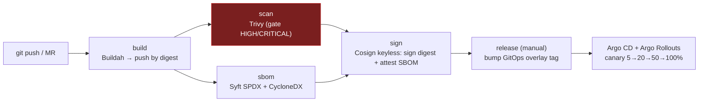

# Phase 8 — CI/CD & DevSecOps

> The supply-chain front door. A GitLab pipeline builds each Acme service, **scans** it (Trivy), generates an **SBOM** (Syft), **keyless-signs** the image digest and **attests** the SBOM (Cosign + GitLab OIDC), then **bumps the GitOps image tag** so Argo CD + Argo Rollouts canary the release. Nothing unscanned or unsigned reaches deployment.

## Pipeline



All stages fan out across the five services with a `parallel: matrix`. See [ADR-0012](../docs/adr/0012-devsecops-supply-chain.md).

## Pinned tooling (June 2026)

| Tool | Version | Role |
|---|---|---|
| Buildah | `quay.io/buildah/stable:v1.43` | Rootless OCI build + push (no Docker daemon) |
| Trivy | `aquasec/trivy:0.71.2` | Vulnerability scan + GitLab report; **gates** the pipeline |
| Syft | `v1.46.0` | SBOM (SPDX for attestation, CycloneDX for GitLab) |
| Cosign | `v3.1.1` | **Keyless** signing + SBOM attestation via Sigstore |

## What makes it production-grade

- **Sign the digest, not the tag.** The build records the immutable `sha256` digest; scan/sbom/sign all operate on `repo@sha256:…`. Tags move; digests don't.
- **Keyless signing.** No long-lived keys. GitLab issues a short-lived OIDC token (`id_tokens: SIGSTORE_ID_TOKEN`, audience `sigstore`); Cosign exchanges it with Sigstore Fulcio/Rekor. The signer identity is the pipeline itself.
- **Hard security gate.** Trivy fails the pipeline on **fixable HIGH/CRITICAL** CVEs (`--exit-code 1 --ignore-unfixed`), while still publishing a full report to the GitLab Security Dashboard.
- **Auditable provenance.** Every image carries a signature and an attached **SPDX SBOM attestation**; CycloneDX SBOMs surface in GitLab's dependency list.
- **GitOps handoff.** `release` edits only the Kustomize `newTag`; deployment is Argo CD's job (Phase 6) and rollout safety is Argo Rollouts' job (Phase 7).

## Required CI/CD variables

| Variable | Where | Purpose |
|---|---|---|
| `CI_REGISTRY*` | predefined | GitLab Container Registry auth (automatic) |
| `SIGSTORE_ID_TOKEN` | `id_tokens` block | Keyless signing OIDC token (automatic) |
| `GITOPS_PUSH_TOKEN` | **you add** (masked) | Project access token with `write_repository` for the `release` commit |

## Enabling it on the project

This repo is a subfolder, so point GitLab at the pipeline file:

**Settings → CI/CD → General pipelines → CI/CD configuration file:**
```
observability-driven-gitops-release-system/ci/.gitlab-ci.yml
```

Add `GITOPS_PUSH_TOKEN` (masked) under **Settings → CI/CD → Variables**. Push a branch / open an MR to trigger build→scan→sbom→sign; run `release` manually on the default branch to ship.

## Verifying a signed image (operator runbook)

```bash
IMAGE=$CI_REGISTRY_IMAGE/payment@sha256:... \
OIDC_ISSUER=https://gitlab.com \
IDENTITY_REGEXP='https://gitlab.com/<group>/.+' \
bash ci/scripts/verify-signature.sh
```

This is also the basis for an **admission policy** (e.g. Kyverno/Sigstore policy-controller) that refuses unsigned images in the cluster — a natural Phase 9/10 hardening step.

## Layout

```text
ci/
├── .gitlab-ci.yml            # the pipeline (self-contained)
├── scripts/verify-signature.sh
└── README.md
```

## Validation done in this phase

- `.gitlab-ci.yml` parses as valid YAML; stage/needs graph is consistent
- `verify-signature.sh` passes `bash -n` / `make lint-scripts`
- The `release` job's `sed` targets the overlay's per-service `newTag` (verified against `gitops/acme/overlays/dev/kustomization.yaml`)

> The pipeline executes on a GitLab runner (not in this sandbox). It is authored to run as-is once the CI config path + `GITOPS_PUSH_TOKEN` are set.

## Design decision

See [ADR-0012 — DevSecOps supply chain](../docs/adr/0012-devsecops-supply-chain.md).
