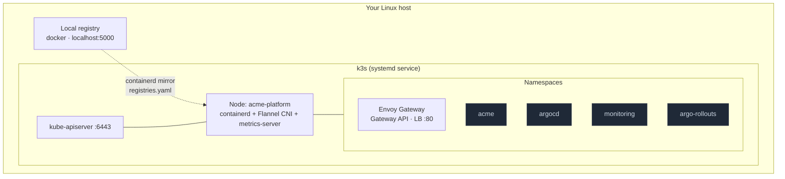

# Phase 2 — Local Kubernetes Platform (k3s)

> Reproducible, single-command local Kubernetes for developing and demoing the platform. This page is the **in-depth operator guide**; the top-level [README](../README.md#phase-2--local-kubernetes-platform-k3s) has the condensed version.

## What `make up` builds



The bootstrap performs five idempotent steps:

| Step | Script | What it does |
|---|---|---|
| 0 | `00-preflight.sh` | Verifies Linux, `sudo`, `curl`/`docker`/`kubectl`, the Docker daemon, and that ports 6443/80/443/5000 are free. |
| 1 | `01-local-registry.sh` | Starts a `registry:2` container on `:5000` with a persistent volume. |
| 2 | `02-install-k3s.sh` | Stages config + registry mirror, installs pinned k3s, exports a repo-local kubeconfig, waits for node Ready. |
| 3 | `03-namespaces.sh` | Creates `acme`, `argocd`, `monitoring`, `argo-rollouts`. |
| 4 | `04-gateway-api.sh` | Installs Gateway API CRDs + Envoy Gateway, then the `acme` GatewayClass and shared `acme-gateway`. |

## Prerequisites

- **Linux** host (k3s installs a `systemd` service). On Windows use WSL2; on macOS use a Linux VM.
- **sudo** privileges (k3s install and uninstall are privileged).
- **Docker** running and usable by your user (`docker info` succeeds).
- **kubectl**, **curl**, and **Helm** on `PATH` (Helm installs Envoy Gateway).

Verify everything at once:

```bash
make check-tools
```

## Bring the platform up

```bash
make up
```

This runs `clusters/bootstrap/bootstrap.sh`. It is **safe to re-run** — each step detects existing state and skips or reuses it. Expect the first run to take 1–3 minutes (it downloads the k3s binary and the ingress-nginx images).

When it finishes you'll see a summary. Point your shell at the cluster:

```bash
export KUBECONFIG=$(pwd)/clusters/.kubeconfig
# or:  eval "$(make kubeconfig)"

kubectl get nodes
kubectl get ns
```

> **Why a repo-local kubeconfig?** We never touch `~/.kube/config`. The cluster's kubeconfig is written to `clusters/.kubeconfig` (gitignored), so your existing clusters/contexts are untouched. Every script in this repo points `KUBECONFIG` at that file automatically.

## Verify the platform

```bash
make cluster-info
```

This read-only command prints cluster-info, nodes, the platform namespaces, the Envoy Gateway pods, the Gateway resources, and the local registry catalog. A healthy result looks like:

- Node `acme-platform` in `Ready` state
- All four namespaces `Active`
- `envoy-gateway` pod `Running` in `envoy-gateway-system`; `GatewayClass/acme` Accepted and `Gateway/acme-gateway` Programmed with an address
- `http://localhost:5000/v2/_catalog` returning JSON

## Use the local registry

The registry is wired into k3s via `clusters/k3s/registries.yaml`. To ship an image to the cluster:

```bash
docker pull nginx:1.27-alpine
docker tag  nginx:1.27-alpine localhost:5000/nginx:1.27-alpine
docker push localhost:5000/nginx:1.27-alpine

# k3s can now pull it:
kubectl -n acme create deployment demo --image=localhost:5000/nginx:1.27-alpine
kubectl -n acme rollout status deployment/demo
kubectl -n acme delete deployment demo   # cleanup
```

Phase 3 automates this build→push→deploy loop for the Acme microservices.

## Configuration knobs

All values live in `clusters/bootstrap/config.env` and are overridable via the environment:

| Variable | Default | Purpose |
|---|---|---|
| `K3S_VERSION` | `v1.30.6+k3s1` | Pinned k3s/Kubernetes version |
| `CLUSTER_NAME` | `acme-platform` | Logical cluster/node name |
| `REGISTRY_NAME` | `acme-registry` | Local registry container name |
| `REGISTRY_PORT` | `5000` | Local registry host port |
| `GATEWAY_API_VERSION` | `v1.5.0` | Pinned Gateway API CRDs (standard channel) |
| `ENVOY_GATEWAY_VERSION` | `v1.8.1` | Pinned Envoy Gateway controller |
| `KUBECONFIG_PATH` | `clusters/.kubeconfig` | Where the kubeconfig is written |

Example:

```bash
K3S_VERSION=v1.31.2+k3s1 REGISTRY_PORT=5050 make up
```

## Tear it down

```bash
make down                 # prompts before destroying
ASSUME_YES=1 make down     # non-interactive
KEEP_REGISTRY=1 make down   # keep the registry + its cached images
```

Teardown runs `k3s-uninstall.sh` (removes the cluster and its data), removes the registry container and volume, and deletes the repo-local kubeconfig.

## Troubleshooting

| Symptom | Likely cause | Fix |
|---|---|---|
| `port 6443 already in use` | A previous k3s or another API server is running | `make down`, or stop the conflicting service |
| `make up` hangs at "waiting for node Ready" | CNI/image pulls slow or blocked | `sudo systemctl status k3s`, then `sudo journalctl -u k3s -e` |
| ingress controller never Ready | Image pull blocked or no LoadBalancer IP | `kubectl -n envoy-gateway-system describe pod`; ensure servicelb is enabled |
| `ErrImagePull` for `localhost:5000/...` | Registry down or mirror not staged | `curl localhost:5000/v2/`, confirm `/etc/rancher/k3s/registries.yaml` exists, then `sudo systemctl restart k3s` |
| `kubectl` can't connect | `KUBECONFIG` not exported | `eval "$(make kubeconfig)"` |
| Permission denied writing `/etc/rancher/k3s` | No sudo | Re-run with a user that has sudo |

Useful diagnostics:

```bash
sudo systemctl status k3s            # service health
sudo journalctl -u k3s -e            # k3s logs
kubectl get events -A --sort-by=.lastTimestamp | tail -20
docker logs acme-registry            # registry logs
```

## Design notes

See [ADR-0004](../docs/adr/0004-local-platform-k3s.md) (k3s, local registry, repo-local kubeconfig) and [ADR-0005](../docs/adr/0005-gateway-api-envoy-gateway.md) (why Gateway API + Envoy Gateway replaced ingress-nginx, and how it sets up Argo Rollouts canary in Phase 7). The production topology is described as Terraform in Phase 4.
