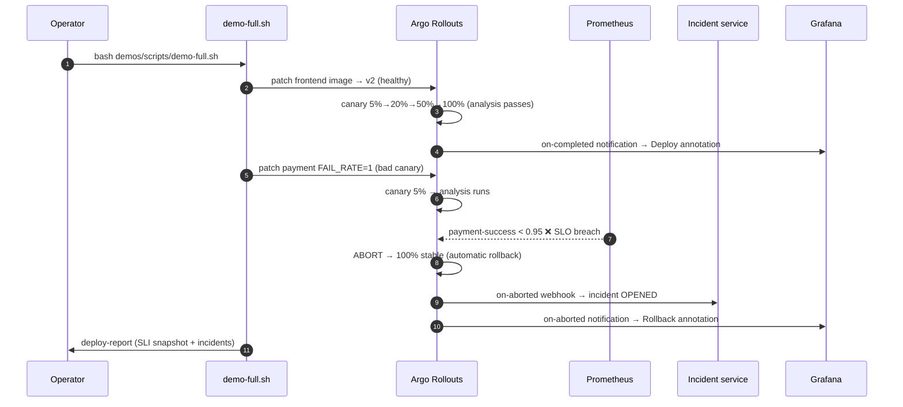

# Phase 10 — Demos, Fault Injection & Hardening

> The capstone phase. Every layer of the platform — GitOps, canary delivery, SLO analysis, incident creation, and Grafana annotations — is exercised through reproducible, observable fault scenarios. Anyone can run these demos from scratch on the local k3s cluster.

## Demo loop in one picture



## Layout

```text
demos/
├── README.md                  # this file
├── fault-injection/
│   └── scenarios.md           # 4 canonical fault scenarios with exact commands
├── scripts/
│   ├── demo-full.sh           # interactive guided end-to-end demo
│   ├── load-gen.sh            # background storefront traffic generator
│   ├── port-forwards.sh       # opens all 5 platform UIs in one command
│   └── reset-demo.sh          # restores clean baseline between demo runs
├── screenshots-checklist.md   # 30+ screenshot items for portfolio / interview
└── troubleshooting.md         # 7-layer diagnostic runbook
```

## Quick start

### Prerequisites

1. Platform running: `make up` → `make observability` → `make gitops` → `make rollouts`
2. Images in local registry: `PUSH=1 make build-apps`
3. Acme workloads deployed: `kubectl apply -k gitops/acme/overlays/dev`

### One command

```bash
bash demos/scripts/demo-full.sh
```

The script is interactive (pause between steps). For a screen recording set `SKIP_WAIT=1`:

```bash
SKIP_WAIT=1 bash demos/scripts/demo-full.sh
```

### Open all UIs first

```bash
bash demos/scripts/port-forwards.sh
# Argo CD   → http://localhost:8081   (admin / see secret)
# Grafana   → http://localhost:3000   (admin / admin)
# Prometheus→ http://localhost:9090
# Alertmgr  → http://localhost:9093
# Incidents → http://localhost:8090/incidents
```

### Individual scenarios

See [fault-injection/scenarios.md](./fault-injection/scenarios.md) for step-by-step commands for:
- **Scenario 1** — payment provider failure → `payment-success` SLO breach → rollback
- **Scenario 2** — high latency injection → `p95-latency` SLO breach → rollback
- **Scenario 3** — crash-loop → `restart-count` guardrail → rollback
- **Scenario 4** — healthy canary → all SLOs pass → auto-promotion to 100%

### Reset between runs

```bash
bash demos/scripts/reset-demo.sh
```

## What to show on each panel

### Grafana — "Acme Platform — Service Overview"

| Panel | Healthy canary | Bad canary (payment failure) |
|---|---|---|
| Request rate | Flat; slight blip at 5% | Flat |
| HTTP success ratio | Stays ≥ 99% | payment dips below 95% at canary step |
| P95 latency | Stays ≤ 500ms | Normal for payment scenario |
| Payment success stat | Green | Turns **red** within 2 analysis intervals |
| Deploy annotation | ✅ vertical green marker at promotion | 🔴 vertical red marker at rollback |

### Argo CD UI

Show the application tree before and after the bad canary:
- Before: all apps green, acme at latest revision
- During canary: acme shows `Progressing`
- After rollback: acme back to `Healthy` at the stable revision

### Argo Rollouts dashboard / CLI

```bash
kubectl argo rollouts get rollout payment -n acme --watch
```

Shows the step-by-step progression: `setWeight 5%` → `AnalysisRun Running` → `AnalysisRun Failed` → `Degraded` → rollback.

## Troubleshooting

See [troubleshooting.md](./troubleshooting.md) for a full 7-layer diagnostic runbook (cluster, observability, GitOps, Rollouts, CI, incident service, SLOs).

## Screenshots

See [screenshots-checklist.md](./screenshots-checklist.md) for 11 sections and 30+ screenshot items that document every proof-point for a portfolio or interview.

## Design decision

[ADR-0014](../docs/adr/0014-demo-fault-injection.md) — fault injection via env-var knobs (no sidecar needed), fully reversible, reproducible on the local cluster.
