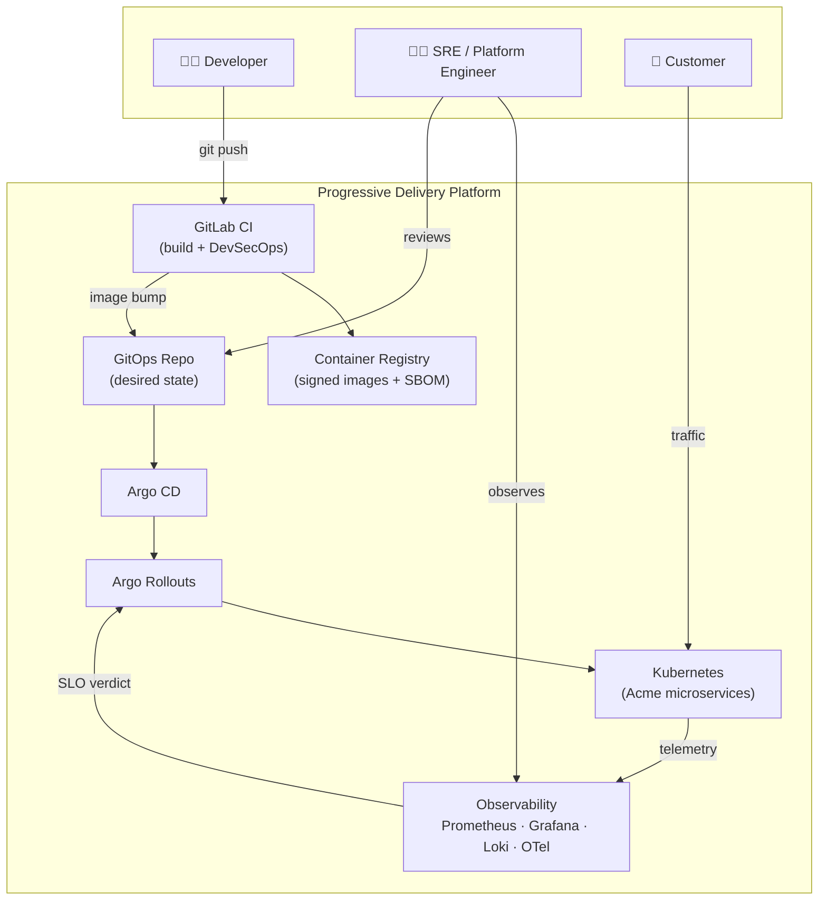
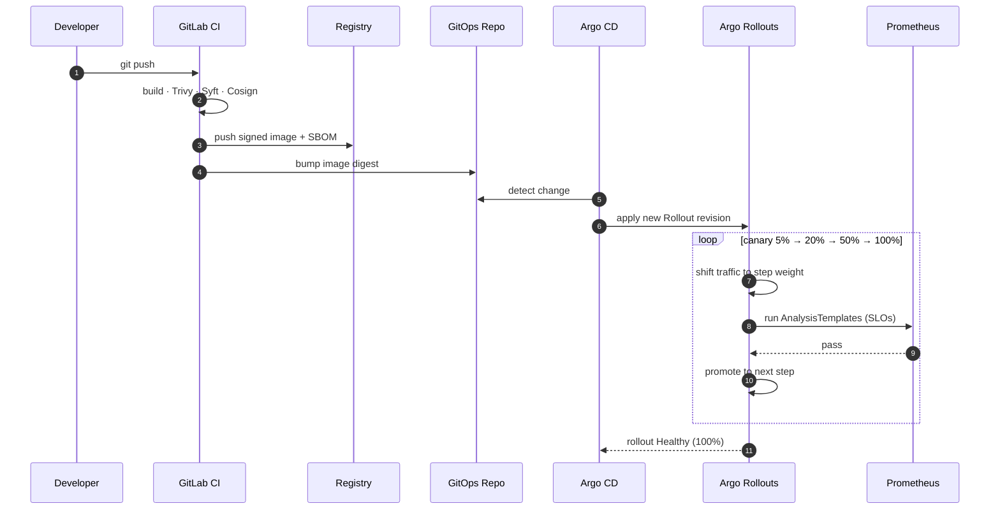
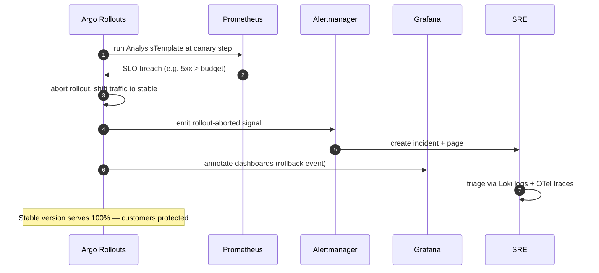
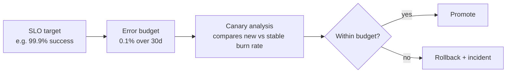

# Architecture Overview

> This document explains **what** the platform is, **why** each component exists, and **how** a release flows from a developer's laptop to a validated production rollout — or an automatic rollback.

## 1. Problem statement

Acme Commerce ships dozens of releases per day across five microservices. Classic CI/CD pipelines promoted releases to 100% of traffic the moment tests passed in CI. CI tests cannot observe **production reality**: real traffic mix, real dependencies, real latency tails, real payment-gateway behavior. The result was a recurring failure mode — a release that is "green" in CI but degrades a production SLO, discovered only when customers (or dashboards) complained.

**Thesis:** a deployment is a *hypothesis* ("this version is at least as healthy as the last"). The platform's job is to **test that hypothesis against live telemetry** and act automatically.

## 2. Design principles

| Principle | Consequence in this platform |
|---|---|
| Git is the single source of truth | All desired state lives in Git; Argo CD reconciles it (GitOps). |
| Progressive exposure | Traffic shifts in steps (5 → 20 → 50 → 100%), never all at once. |
| Decisions from data, not time | Promotion gates on Prometheus SLO analysis, not a fixed wait. |
| Safe by default | Any failing SLO aborts and rolls back automatically. |
| Supply-chain integrity | Images are scanned, SBOM'd, and signed before they can deploy. |
| Everything is observable | Metrics, logs, and traces for the apps *and* the platform itself. |
| Operability is a feature | ADRs, runbooks, dashboards, and demos ship with the code. |

## 3. System context (C4 level 1)

## 4. Component responsibilities (and why each exists)

| Component | Why it exists |
|---|---|
| **GitLab CI** | Builds artifacts and enforces the DevSecOps gate. Nothing reaches the registry unvalidated. |
| **Trivy** | Fails the build on critical CVEs in the image — shift-left vulnerability control. |
| **Syft** | Generates a Software Bill of Materials so every deployed artifact is auditable. |
| **Cosign** | Cryptographically signs images; the cluster can refuse unsigned artifacts. |
| **Container Registry** | Stores signed, scanned images addressed by immutable digest. |
| **GitOps Repo** | Declares desired cluster state. The only way to change production is a Git change. |
| **Argo CD** | Continuously reconciles the cluster to match the GitOps repo; detects and reports drift. |
| **Argo Rollouts** | Replaces the Deployment controller to provide canary/blue-green with analysis-gated steps. |
| **Prometheus** | Scrapes app + platform metrics; backs the `AnalysisTemplate` SLO queries. |
| **AnalysisTemplates** | Reusable, parameterized SLO checks run between canary steps. The decision engine. |
| **Grafana** | Human-facing dashboards + deploy annotations correlating releases with telemetry. |
| **Loki** | Log aggregation for root-cause analysis when a rollout aborts. |
| **OpenTelemetry** | Distributed traces across microservices for latency attribution. |
| **Alertmanager** | Routes alerts, dedupes, and feeds incident creation on rollback. |
| **Terraform** | Declares the production-equivalent cloud topology as code. |
| **Kind** | Reproducible local Kubernetes for development and demos. |

## 5. Deployment lifecycle (happy path)

## 6. Rollback lifecycle (failure path)

## 7. SLO & error-budget model (preview)

Promotion is gated on SLOs. Each service has technical SLOs (availability, latency) and, where relevant, **business SLOs** (payment success, checkout success). An **error budget** is the allowed amount of failure over a window; canary analysis checks whether the new version is spending budget faster than the stable version. Full definitions land in **Phase 9**.

## 8. How this maps to the phases

This overview describes the **target** system. It is realized incrementally — see [PHASES.md](../PHASES.md). Each phase deepens one slice of this diagram until the full loop (push → validate → deploy → analyze → decide → report) is closed.

## 9. Related decisions

- [ADR-0001 — Record architecture decisions](../adr/0001-record-architecture-decisions.md)
- [ADR-0002 — Progressive delivery with Argo Rollouts](../adr/0002-progressive-delivery-with-argo-rollouts.md)
- [ADR-0003 — Observability-driven promotion](../adr/0003-observability-driven-promotion.md)
