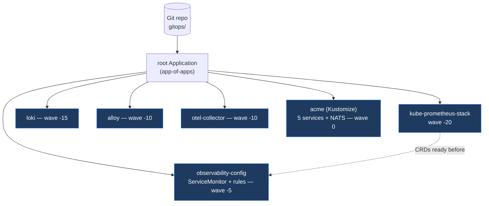

# Phase 6 — GitOps with Argo CD

> Git becomes the single source of truth. **Argo CD** (chart `10.0.0`, app `v3.4.4`) continuously reconciles the whole platform — observability stack **and** Acme workloads — from this repository, using the **app-of-apps** pattern with **sync waves** for ordering.

## How it fits together



Sync waves guarantee the Prometheus Operator CRDs exist before any `ServiceMonitor`/`PrometheusRule` is applied. See [ADR-0010](../docs/adr/0010-gitops-argocd.md).

## Layout

```text
gitops/
├── charts.env                  # pinned Argo CD chart + repo/branch defaults
├── install.sh / uninstall.sh   # bootstrap / teardown
├── set-repo.sh                 # re-point all manifests at a fork
├── values/argocd.values.yaml   # Argo CD Helm values (local profile)
├── projects/                   # AppProjects: platform (broad), acme (scoped)
├── bootstrap/root-app.yaml     # the app-of-apps root Application
├── apps/                       # child Applications (one file per component)
│   ├── 10-kube-prometheus-stack.app.yaml   # multi-source Helm + git values
│   ├── 12-loki.app.yaml
│   ├── 13-alloy.app.yaml
│   ├── 14-otel-collector.app.yaml
│   ├── 15-observability-config.app.yaml    # ServiceMonitor + SLO rules
│   └── 20-acme.app.yaml                     # Kustomize overlay
└── acme/                       # desired state for the workloads
    ├── base/                   # 5 services + auth Secret + NATS
    └── overlays/dev/           # namespace + image tags (localhost:5000/acme/*:dev)
```

## Prerequisites

- A running cluster (`make up`) with the observability namespaces, **Helm** + **kubectl**.
- Service images available to the cluster's registry: `PUSH=1 make build-apps`.
- This repo reachable by Argo CD over HTTPS. The committed `repoURL` is
  `https://github.com/onedord1/DevOps-Projects.git`; for a fork run:
  ```bash
  GITOPS_REPO_URL=https://github.com/you/your-repo.git bash gitops/set-repo.sh
  git commit -am "gitops: point at my fork" && git push
  ```

## Bootstrap

```bash
make gitops
```

This installs Argo CD, waits for its CRDs, then applies the AppProjects and the root Application. Argo CD takes over from there — reconciling every child app from Git.

```bash
# watch it converge
kubectl -n argocd get applications -w

# UI (admin / printed password)
kubectl -n argocd port-forward svc/argocd-server 8081:80
# password:
kubectl -n argocd get secret argocd-initial-admin-secret -o jsonpath='{.data.password}' | base64 -d; echo
```

Once green, browse the storefront through the Gateway and watch metrics/logs in Grafana (Phase 5).

## What Argo CD now manages

| Application | Source | Namespace | Wave |
|---|---|---|---|
| kube-prometheus-stack | Helm 87.3.0 + git values | monitoring | -20 |
| loki | Helm 7.1.0 + git values | monitoring | -15 |
| alloy | Helm 1.10.0 + git values | monitoring | -10 |
| otel-collector | Helm 0.159.1 + git values | monitoring | -10 |
| observability-config | git (ServiceMonitor + rules) | monitoring | -5 |
| acme | git (Kustomize overlay) | acme | 0 |

The `acme` app deploys the five services (as Deployments for now), NATS, the auth Secret, and the frontend `HTTPRoute` on the Phase 2 Gateway. Services carry `app.kubernetes.io/part-of=acme-platform` so the Phase 5 ServiceMonitor scrapes them automatically.

## Relationship to the Phase 5 script

`make observability` (Phase 5) installs the same charts imperatively for a quick start. Under GitOps, **Argo CD is the source of truth** for those releases — once `make gitops` runs you no longer need the imperative step. Both paths use the identical values files in `observability/values/`.

## Secrets

The dev `AUTH_SEED` ships in `acme/base/platform.yaml` as a clearly-insecure placeholder. Production must source it from **External Secrets Operator** (Argo maintainers recommend against the Vault plugin) — added as a `platform` Application when needed.

## Validation done in this phase

- `make lint-scripts` — clean
- All 18 GitOps YAML files parse
- `kubectl kustomize gitops/acme/overlays/dev` builds: 5 services + NATS, images correctly remapped, `part-of` label on Services without altering Pod selectors

## Teardown

```bash
make gitops-down     # deletes root app (cascades/prunes children), then Argo CD
```

## Design decision

See [ADR-0010 — GitOps with Argo CD](../docs/adr/0010-gitops-argocd.md).
