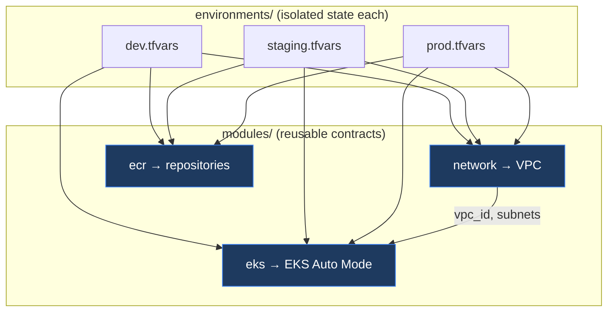

# Phase 4 — Infrastructure as Code (Terraform)

> Production-grade, reusable Terraform for the Acme platform's cloud topology on **AWS**: VPC, **EKS** (Auto Mode), and **ECR**. Reusable modules are composed per environment with **isolated remote state**, so `dev`, `staging`, and `prod` are architecturally identical and independently deployable.

## Layout & why it's structured this way

```text
infra/
├── modules/                 # reusable, single-concern building blocks
│   ├── network/             #   VPC (wraps terraform-aws-modules/vpc/aws ~> 6.6)
│   ├── eks/                 #   EKS Auto Mode (wraps terraform-aws-modules/eks/aws ~> 21.0)
│   └── ecr/                 #   ECR repositories (native resources)
├── bootstrap/               # one-time: S3 + DynamoDB remote-state backend (local state)
└── environments/            # one composition + ISOLATED state per environment
    ├── dev/                 #   small, single-NAT, public API endpoint
    ├── staging/             #   3 AZs, per-AZ NAT
    └── prod/                #   3 AZs, per-AZ NAT, PRIVATE API endpoint
```

This follows the widely-recommended **modules + environments** pattern ([ADR-0008](../docs/adr/0008-terraform-structure.md)):

- **Reusable modules** encapsulate one concern each (no "god modules"). Their inputs/outputs are a versioned contract.
- **Each environment owns its own state file** (a distinct backend `key`) to minimize blast radius — an apply against `dev` can never touch `prod`.
- **Environments differ only by `*.tfvars`**; the module composition (`main.tf`) is identical, guaranteeing parity.
- Heavy lifting (VPC, EKS) reuses **well-maintained registry modules** rather than reinventing them.



## Prerequisites

- **Terraform** `>= 1.9` and **AWS credentials** with permissions to create VPC/EKS/ECR/IAM/S3/DynamoDB.
- The **AWS provider `~> 6.28`** is required by the upstream modules (resolved automatically).

> Validation (`fmt`/`validate`) needs **no credentials**. Only `plan`/`apply` reach AWS.

## One-time: create the remote-state backend

```bash
cd infra/bootstrap
cp terraform.tfvars.example terraform.tfvars   # set a globally-unique bucket name
terraform init
terraform apply
# note the outputs → plug into each environments/<env>/backend.hcl
```

This creates a versioned, encrypted, private S3 bucket and a DynamoDB lock table.

## Per-environment workflow

```bash
cd infra/environments/dev

# 1) point the partial backend at the bootstrap bucket (one-time per env)
cp backend.hcl.example backend.hcl     # edit bucket/account
terraform init -backend-config=backend.hcl

# 2) review and apply
terraform plan  -var-file=dev.tfvars
terraform apply -var-file=dev.tfvars

# 3) use the cluster
$(terraform output -raw kubeconfig_command)
kubectl get nodes
```

Swap `dev` → `staging`/`prod` (with `staging.tfvars`/`prod.tfvars`) for the other environments. From the repo root you can also use the Makefile:

```bash
make tf-fmt                 # format check across infra/
make tf-validate ENV=dev    # init (-backend=false) + validate
make tf-plan ENV=prod       # plan against prod.tfvars (needs creds + backend)
```

## Environment matrix

| | dev | staging | prod |
|---|---|---|---|
| VPC CIDR | `10.10.0.0/16` | `10.20.0.0/16` | `10.30.0.0/16` |
| AZs | 2 | 3 | 3 |
| NAT gateways | single (cheap) | per-AZ (HA) | per-AZ (HA) |
| EKS API endpoint | public | public | **private** |
| State key | `dev/terraform.tfstate` | `staging/terraform.tfstate` | `prod/terraform.tfstate` |

CIDRs are deliberately non-overlapping to allow future VPC peering / transit gateway.

## What gets created

- **network**: VPC across N AZs, public + private subnets, NAT egress, and Kubernetes subnet tags (`kubernetes.io/role/elb`, `internal-elb`, cluster discovery).
- **eks**: an EKS cluster in **Auto Mode** (AWS-managed nodes), OIDC provider for IRSA, and the access entry for the Terraform identity.
- **ecr**: one immutable, scan-on-push repository per service (`acme-platform/frontend`, `…/payment`, `…/order`, `…/inventory`, `…/notification`) with a retention lifecycle policy.

## Relationship to the local k3s platform (Phase 2)

The local **k3s** cluster (`make up`) is the zero-cost developer inner loop. This Terraform describes the **production-equivalent cloud topology**. The application, GitOps, and progressive-delivery layers (Phases 6–7) are cluster-agnostic and run on either. RKE2/self-managed clusters could be added as an alternative `cluster` module without changing the environment structure.

## Validation done in this phase

- `terraform fmt -check -recursive infra` — clean
- `terraform init -backend=false && terraform validate` — **Success** for `environments/dev` (transitively validating `network`, `eks`, `ecr`) and for `bootstrap`

## Design decision

See [ADR-0008 — Terraform repository structure](../docs/adr/0008-terraform-structure.md).
