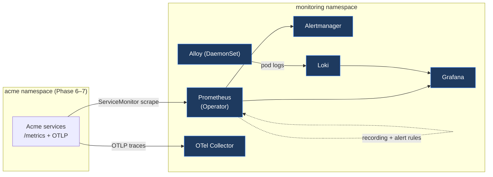

# Phase 5 — Observability Stack

> The telemetry foundation the SLO-gated rollouts depend on: **metrics** (Prometheus), **dashboards** (Grafana), **logs** (Loki + Alloy), **traces** (OpenTelemetry Collector), and **alerting** (Alertmanager) — all installed into the `monitoring` namespace via pinned Helm charts.

## What `make observability` installs



| Component | Chart | Version | Role |
|---|---|---|---|
| kube-prometheus-stack | `prometheus-community/kube-prometheus-stack` | `87.3.0` | Prometheus Operator, Prometheus, Alertmanager, Grafana, node-exporter, kube-state-metrics |
| Loki | `grafana/loki` | `7.1.0` | Log storage (single-binary + filesystem locally) |
| Alloy | `grafana/alloy` | `1.10.0` | Log collection DaemonSet (Promtail's successor) |
| OpenTelemetry Collector | `open-telemetry/opentelemetry-collector` | `0.159.1` | OTLP trace/metrics gateway |

Versions are pinned in [`charts.env`](./charts.env). See [ADR-0009](../docs/adr/0009-observability-stack.md) for the rationale (including why **Alloy replaces EOL Promtail**).

## Layout

```text
observability/
├── charts.env                       # pinned chart versions + repos
├── install.sh / uninstall.sh        # idempotent install/teardown
├── values/                          # Helm values per chart
│   ├── kube-prometheus-stack.values.yaml
│   ├── loki.values.yaml
│   ├── alloy.values.yaml
│   └── otel-collector.values.yaml
├── prometheus/
│   ├── servicemonitor-acme.yaml     # scrape the Acme services' /metrics
│   └── rules/
│       ├── acme-recording.rules.yaml  # RED + business SLIs (acme:* series)
│       └── acme-slo.alerts.yaml       # SLO breach + availability alerts
├── grafana/dashboards/acme-overview.json
└── promql/examples.md               # query library (also used by Phase 7)
```

## Prerequisites

- A running cluster (`make up`) and **Helm** + **kubectl** on `PATH`.
- The scripts use the repo-local kubeconfig (`clusters/.kubeconfig`) automatically.

## Install

```bash
make observability
```

This adds the Helm repos and installs the four charts (waiting for each), then applies the Acme `ServiceMonitor`, recording/alerting rules, and the Grafana dashboard ConfigMap. It is **idempotent** — re-running upgrades in place.

## Access

```bash
# Grafana (admin / admin) — dashboard "Acme Platform — Service Overview"
kubectl -n monitoring port-forward svc/kube-prometheus-stack-grafana 3000:80

# Prometheus
kubectl -n monitoring port-forward svc/kube-prometheus-stack-prometheus 9090:9090

# Alertmanager
kubectl -n monitoring port-forward svc/kube-prometheus-stack-alertmanager 9093:9093
```

Point application traces at the collector (in-cluster):

```
OTEL_EXPORTER_OTLP_ENDPOINT=http://otel-collector.monitoring.svc:4318
```

## What you get

- **Scraping:** the `acme-services` ServiceMonitor scrapes `/metrics` on every Service in `acme` labelled `app.kubernetes.io/part-of=acme-platform` (port `http`), with `honorLabels` so the app's own `service` label is preserved.
- **Recording rules** (`acme:*`): request rate, 5xx rate, success ratio, P95 latency, payment-success ratio, checkout-success ratio — the SLIs the Phase 7 AnalysisTemplates evaluate.
- **Alerts:** service down, low success rate, high P95 latency, low payment/checkout success, and a fast error-budget-burn alert — routed through Alertmanager (payments get their own route; critical alerts inhibit related warnings).
- **Dashboards:** an auto-loaded Grafana dashboard with RED panels, business-SLO stats, and a Loki logs panel for `{part_of="acme-platform"}`.
- **PromQL library:** [`promql/examples.md`](./promql/examples.md), including canary-vs-stable comparison queries for Phase 7.

## Tuning knobs

Override any pinned version at install time, e.g.:

```bash
KPS_VERSION=87.3.0 LOKI_VERSION=7.1.0 make observability
```

Edit the files under `values/` for retention, resources, and storage. Production notes (PVCs, object storage, Tempo) are inline in each values file.

## Validation done in this phase

- `make lint-scripts` — install/uninstall scripts syntax-clean
- All values and PrometheusRule/ServiceMonitor manifests parse as valid YAML; the Grafana dashboard is valid JSON
- `make observability` is idempotent and waits on each release (run it against a live cluster)

## Teardown

```bash
make observability-down          # prompts; ASSUME_YES=1 to skip
```

CRDs installed by kube-prometheus-stack are intentionally left in place (Helm does not remove CRDs).

## Design decision

See [ADR-0009 — Observability stack](../docs/adr/0009-observability-stack.md).
