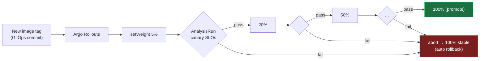

# Phase 7 — Progressive Delivery

> The platform's decision engine. **Argo Rollouts** (chart `2.41.0`, app `v1.9.0`) replaces the Deployments with canary **Rollouts** (5 → 20 → 50 → 100%), and between each step runs **Prometheus SLO analysis** scoped to the canary pods. Any breached SLO **aborts and rolls back automatically**.

## The loop



For `frontend`, traffic is shifted on its **HTTPRoute** via the **Gateway API plugin** (`v0.15.0`). Internal services use replica-based canary; analysis still gates them. See [ADR-0011](../docs/adr/0011-progressive-delivery-analysis.md).

## Layout

```text
rollouts/
├── values/argo-rollouts.values.yaml   # chart values; registers the gatewayAPI plugin
├── rbac/gateway-plugin-rbac.yaml       # lets the controller edit HTTPRoutes
├── install.sh                          # imperative quickstart (else via GitOps)
├── demo.sh                             # load / promote / bad-payment / status
└── README.md

gitops/acme/base/
├── frontend.yaml   payment.yaml   order.yaml   inventory.yaml   # now Rollouts
└── analysis/                       # the 8 reusable AnalysisTemplates
```

## The reusable AnalysisTemplates

All are parameterized (thresholds are `args` with defaults) and filter on the canary pod-hash so they measure **only the canary**:

| Template | Gates on | Default |
|---|---|---|
| `http-success-rate` | non-5xx ratio | ≥ 0.99 |
| `http-5xx-rate` | 5xx ratio | ≤ 0.05 |
| `p95-latency` | P95 seconds | ≤ 0.5 |
| `restart-count` | container restarts (3m) | ≤ 0 |
| `cpu-utilization` | CPU cores | ≤ 0.5 |
| `memory-utilization` | working set bytes | ≤ 128Mi |
| `payment-success` | payment business SLO | ≥ 0.95 |
| `checkout-success` | checkout business SLO | ≥ 0.95 |

Per service: RED templates everywhere; **payment-success** on `payment`; **checkout-success** on `order`; resource guardrails on `inventory`.

## How the canary is isolated in metrics

The Phase 5 ServiceMonitor copies the pod label `rollouts-pod-template-hash` into the metric label `rollouts_pod_template_hash` (`podTargetLabels`). The Rollout passes the current canary hash to each AnalysisTemplate via `valueFrom.podTemplateHashValue: Latest`, and the queries filter on it — so a healthy stable version never masks a failing canary.

## Install

Under GitOps it's automatic (the `argo-rollouts` + `rollouts-rbac` Applications, sync-waves -25/-24, install before the workloads). Imperative quickstart:

```bash
make rollouts          # Helm-install Argo Rollouts + plugin + RBAC
# optional live view:
kubectl argo rollouts get rollout frontend -n acme --watch
```

## Demo — end to end

```bash
# 1) generate storefront traffic so the canary has real SLIs to measure
bash rollouts/demo.sh load        # (leave running in one terminal)

# 2) HEALTHY release → canary promotes through 5→20→50→100%
PUSH=1 TAG=v2 make build-apps      # build/push a v2 image
bash rollouts/demo.sh promote frontend v2
bash rollouts/demo.sh status frontend

# 3) BAD release → SLO breach → AUTOMATIC ROLLBACK
bash rollouts/demo.sh bad-payment  # ships payment with FAIL_RATE=1
bash rollouts/demo.sh status payment
#   payment-success analysis fails within a step → rollout aborts → stable restored
```

> In real use you don't patch the cluster — CI commits an image-tag bump to the Kustomize overlay (Phase 8) and Argo CD + Argo Rollouts do the rest. `demo.sh` patches directly only to make the loop easy to watch locally.

## Validation done in this phase

- `make lint-scripts` clean
- All Rollouts / AnalysisTemplates / RBAC / values parse as YAML
- `kubectl kustomize gitops/acme/overlays/dev` builds: **4 Rollouts**, **8 AnalysisTemplates**, frontend stable+canary Services + HTTPRoute (100/0), images remapped, `part-of` label applied without touching Pod selectors

## Design decision

See [ADR-0011 — Progressive delivery analysis](../docs/adr/0011-progressive-delivery-analysis.md).
