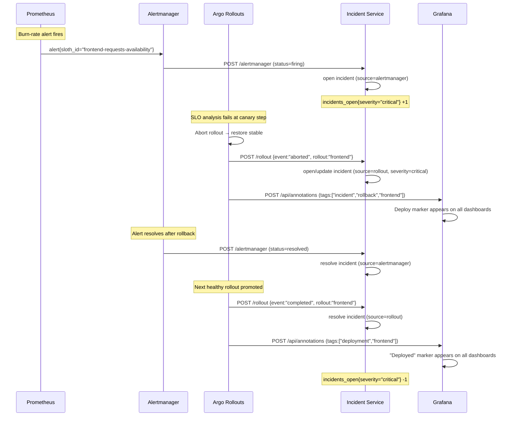

# SLOs, Incidents & Reporting

This directory contains the Service Level Objective (SLO) definitions, generated PrometheusRules, and operational scripts for the Acme platform.

## Contents

```text
slos/
├── sloth/                    # Sloth SLO input files (source of truth)
│   ├── frontend.slo.yaml     # BFF: 99.9% availability, 99% latency < 500ms
│   ├── payment.slo.yaml      # Payment API: 99.5% availability, 99% auth success
│   ├── order.slo.yaml        # Order service: 99.5% availability, 99% checkout success
│   └── inventory.slo.yaml    # Inventory API: 99% availability
├── generated/                # PrometheusRule CRDs (sloth generate output)
│   ├── frontend.prometheusrule.yaml
│   └── payment.prometheusrule.yaml
├── generate.sh               # Run sloth, validate output
├── deploy-report.sh          # Query Prometheus + incident service, print report
└── README.md                 # this file
```

---

## Sloth v0.16.0 — What it generates

[Sloth](https://github.com/slok/sloth) is a CLI that converts a compact SLO declaration (objective, SLI query pair, alerting config) into a full **multi-window multi-burn-rate (MWMBR) PrometheusRule**. The generated rules implement the algorithm described in the [Google SRE Workbook Chapter 5](https://sre.google/workbook/alerting-on-slos/).

For every SLO, Sloth generates:

### Recording rules (8 time windows)

| Metric | Window | Purpose |
|--------|--------|---------|
| `slo:sli_error:ratio_rate5m` | 5m | Current error ratio (fast signal) |
| `slo:sli_error:ratio_rate30m` | 30m | Short slow-burn window |
| `slo:sli_error:ratio_rate1h` | 1h | Fast-burn long window |
| `slo:sli_error:ratio_rate2h` | 2h | Medium window |
| `slo:sli_error:ratio_rate6h` | 6h | Slow-burn long window |
| `slo:sli_error:ratio_rate1d` | 1d | Daily view |
| `slo:sli_error:ratio_rate3d` | 3d | Multi-day trend |
| `slo:sli_error:ratio_rate30d` | 30d | Full SLO period |

Plus metadata:

| Metric | Value |
|--------|-------|
| `slo:objective:ratio` | The SLO objective (e.g. 0.999) |
| `slo:error_budget:ratio` | 1 − objective (e.g. 0.001) |
| `slo:time_period:days` | 30 |
| `slo:current_burn_rate:ratio` | 5m error ratio ÷ budget |
| `slo:period_burn_rate:ratio` | 30d error ratio ÷ budget |
| `slo:period_error_budget_remaining:ratio` | 1 − period burn rate |

Every generated series carries `sloth_service`, `sloth_slo`, and `sloth_id` labels for generic dashboard queries.

### Alerting rules (dual-window multi-burn-rate)

Two alert classes per SLO, using **two-window confirmation** to avoid false positives on brief spikes:

| Alert | Burn rate | Windows | Severity | Meaning |
|-------|-----------|---------|----------|---------|
| Fast-burn page | > 14.4× budget | 1h + 5m both exceed | critical | Exhausts 2% budget in < 1h — page someone now |
| Slow-burn ticket | > 6× budget | 6h + 30m both exceed | warning | Exhausts 5% budget in < 6h — create a ticket |

Example thresholds for the **frontend** 99.9% availability SLO (budget = 0.1%):

| Alert | Threshold |
|-------|-----------|
| Fast-burn page | error rate > 0.00144 (0.144%) over 1h+5m |
| Slow-burn ticket | error rate > 0.0006 (0.06%) over 6h+30m |

---

## SLO definitions per service

### frontend (BFF / storefront)

| SLO | Objective | SLI | Error budget |
|-----|-----------|-----|--------------|
| requests-availability | 99.9% | HTTP 5xx / total | 43.8 min/month |
| requests-latency | 99.0% | requests NOT in `le="0.5"` bucket / total | 7.3 h/month |

### payment (Payment API)

| SLO | Objective | SLI | Error budget |
|-----|-----------|-----|--------------|
| requests-availability | 99.5% | HTTP 5xx / total | 3.6 h/month |
| payment-success | 99.0% | `payments_total{result!="success"}` / total | 7.3 h/month |

### order (Order service)

| SLO | Objective | SLI | Error budget |
|-----|-----------|-----|--------------|
| requests-availability | 99.5% | HTTP 5xx / total | 3.6 h/month |
| checkout-success | 99.0% | `orders_total{result!="success"}` / total | 7.3 h/month |

### inventory (Inventory API)

| SLO | Objective | SLI | Error budget |
|-----|-----------|-----|--------------|
| requests-availability | 99.0% | HTTP 5xx / total | 7.3 h/month |

---

## How the incident loop works

The platform closes the full incident lifecycle automatically without human intervention.

### Path 1: Alertmanager → incident webhook

1. Prometheus evaluates recording rules every 30 s.
2. A burn-rate alert (fast or slow) fires and Alertmanager routes it.
3. Alertmanager POSTs to `http://incident.acme.svc:8080/alertmanager`.
4. The incident service opens an incident record keyed by `alertname + service`.
5. When the alert resolves, Alertmanager POSTs again and the incident is closed.

### Path 2: Rollout abort → incident webhook

1. An `AnalysisRun` fails SLO checks; Argo Rollouts aborts the canary and restores stable.
2. Argo Rollouts triggers the `on-rollout-aborted` notification (see `gitops/acme/base/notifications.yaml`).
3. The notification service POSTs `{"event":"aborted",...}` to `http://incident.acme.svc:8080/rollout`.
4. The incident service opens a `critical` incident for the service.
5. The next successful rollout (`on-rollout-completed`) POSTs `{"event":"completed",...}` and the incident is resolved.

### Path 3: Grafana deploy annotations

- On every `completed` rollout, Argo Rollouts fires the `grafana.dashboard` notification.
- This calls the Grafana API (`/api/annotations`) with tags `["deployment", "<service>"]`.
- Every Grafana dashboard panel shows a vertical deployment marker at the exact moment of promotion.
- On `aborted` rollouts, a `["incident","rollback","<service>"]` annotation appears instead.

This means an operator investigating an anomaly can see at a glance: "the P95 latency spike started 2 minutes after the frontend deploy at 14:23."

---

## How to generate the rules

```bash
# If sloth is installed:
make slo-generate

# Or directly:
./slos/generate.sh

# Validate existing generated files only (no sloth required):
./slos/generate.sh --validate
```

After regenerating, commit the updated files in `slos/generated/` to git. Argo CD (`16-slo-rules`) will apply them to the cluster on the next sync.

### Install sloth v0.16.0

```bash
# Linux amd64
curl -sSL https://github.com/slok/sloth/releases/download/v0.16.0/sloth-linux-amd64 \
  -o /usr/local/bin/sloth && chmod +x /usr/local/bin/sloth

# macOS arm64
curl -sSL https://github.com/slok/sloth/releases/download/v0.16.0/sloth-macos-arm64 \
  -o /usr/local/bin/sloth && chmod +x /usr/local/bin/sloth

sloth version
```

---

## How to run the deploy report

```bash
# All services, print to stdout
make deploy-report

# Single service
PROMETHEUS_URL=http://localhost:9090 ./slos/deploy-report.sh --service payment

# Write JSON report
./slos/deploy-report.sh --json reports/my-report.json

# Port-forward if running locally
kubectl -n monitoring port-forward svc/kube-prometheus-stack-prometheus 9090:9090 &
kubectl -n acme port-forward svc/incident 8090:8080 &
make deploy-report
```

Sample output:

```
==> Deployment Report — 2026-06-28 14:35:00 UTC

==> SLI Snapshot (last 24h average)

SERVICE         SUCCESS RATE    P95 LATENCY     PAYMENT OK        CHECKOUT OK
--------------  --------------  --------------  ----------------  ------------------
frontend        99.97%          82ms            —                 —
payment         99.89%          64ms            99.94%            —
order           99.91%          91ms            —                 99.88%
inventory       99.95%          45ms            —                 —

==> Incident Summary

  Open incidents:              0
  Closed incidents (last 24h): 1

 [OK ] Report complete
```

---

## Incident + annotation flow diagram



---

## Architecture Decision Record

See [docs/adr/0013-slos-incidents-reporting.md](../docs/adr/0013-slos-incidents-reporting.md) for the rationale behind the Sloth choice, incident webhook design, and annotation strategy.
